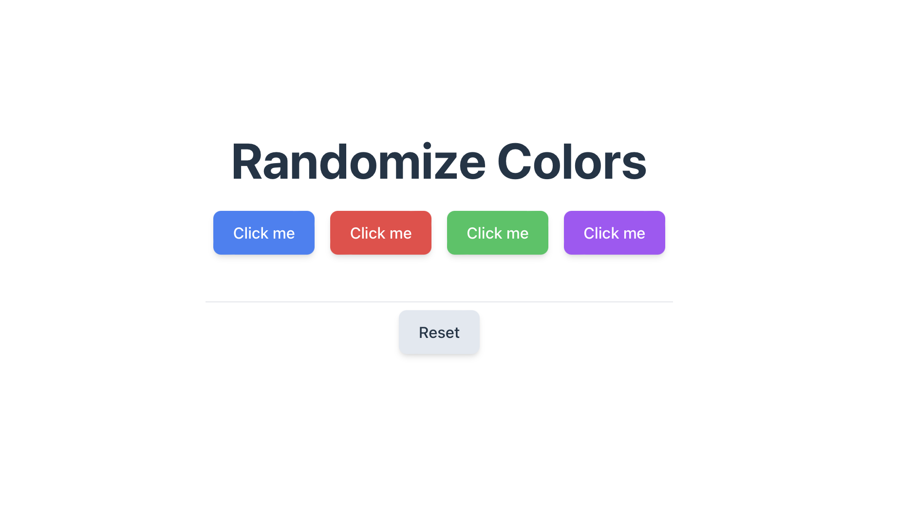

<h1 align="center">🔴 🟣 🟡 • Randomize Colors • 🟢 🟠 🔵 </h1>
<h3 align="center">My first React project in a series 
 
https://randomizecolors.netlify.app

# 01
The most popular piece of advice I've received here on LinkedIn about my journey to become a developer was to get my hands dirty and create a variety of projects, even those that might seem useless or ridiculous to me.

Well, no sooner said than done.

I decided to dive into exploring React, and here's my very first project: a color randomizer. 
 
Useful? Not quite. 
Silly? Well...

But it's not the project itself that matters, but the journey to get there. 
Each project, no matter how trivial or seemingly senseless it may be, brings me one step closer to my goal.

  

  

### Languages
• HTML 
• CSS 
• [tailwindcss](https://tailwindcss.com) 
• [React](https://react.dev) 

### Bundler 
[Vite](https://vitejs.dev)

### Webhost
[Netlify](https://www.netlify.com)
